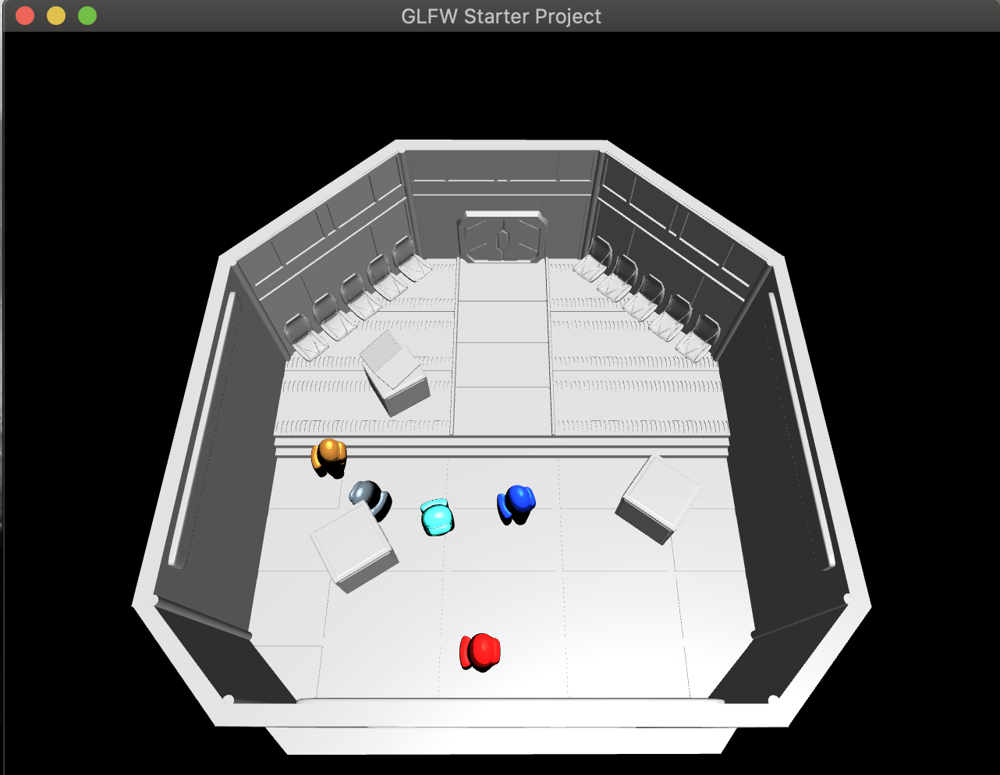
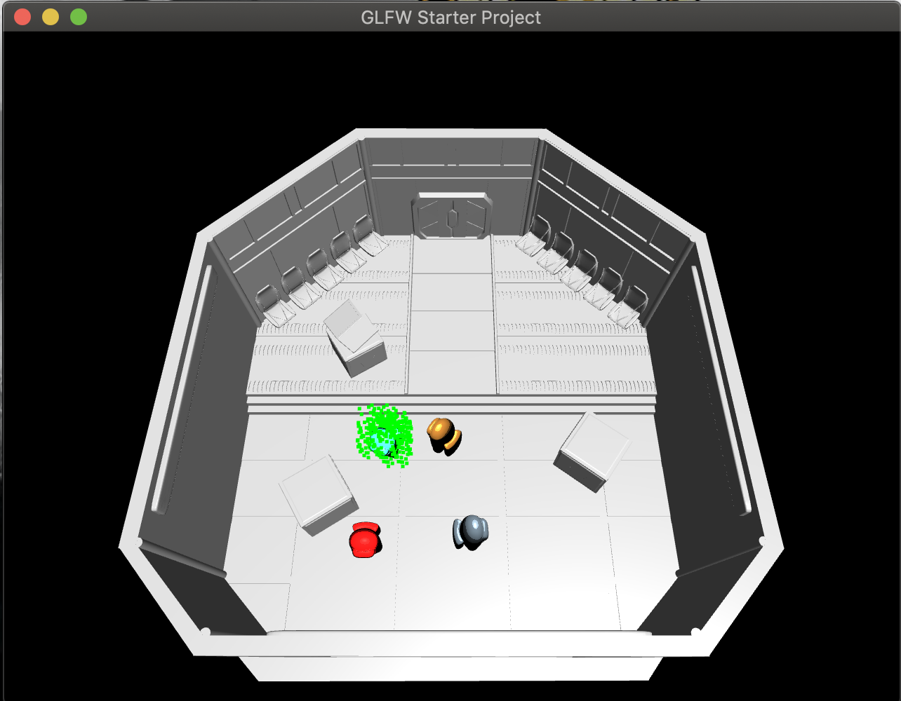

# Among_Us_Waiting_Room_openGL

## Overview:
This is an openGL project implemented in C++ that mimics the waiting room when playing the online game Among Us.
Use the arrow keys to move the player around.

## Installation Requirements:
- modern OpenGL (at least 3.3+)
- C++
- follow the tutorial on [link](http://ivl.calit2.net/wiki/index.php/BasecodeCSE167F20) to setup Visual Studio Code for windows and XCode for MacOS.

## Sample usages:

